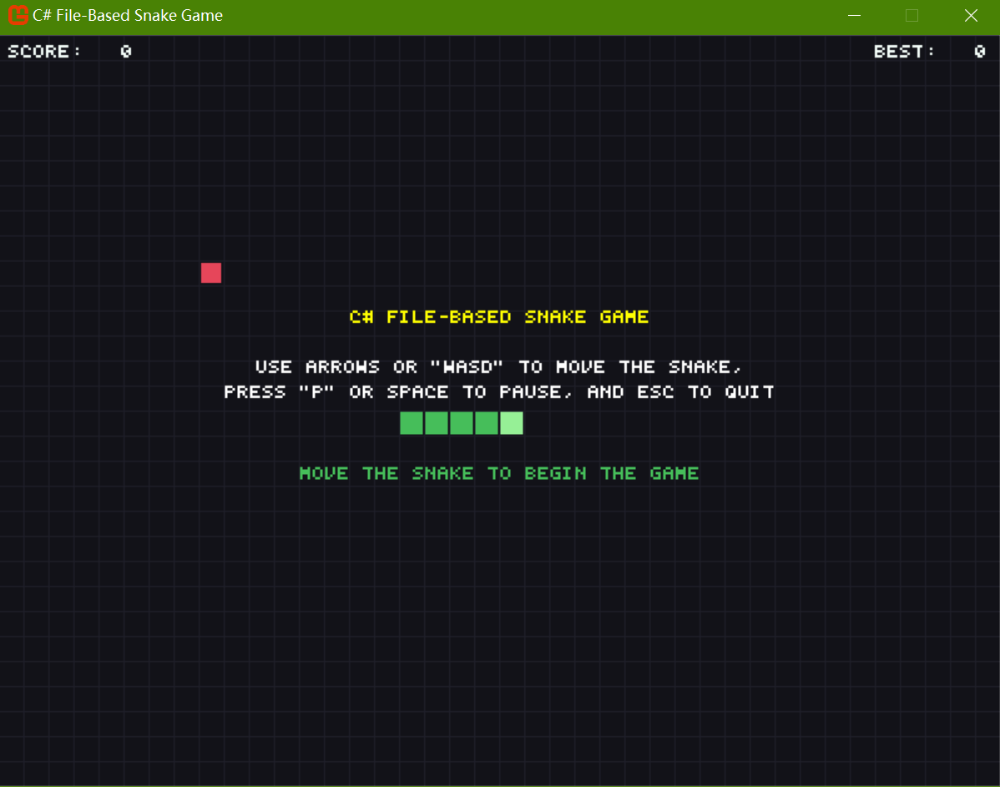
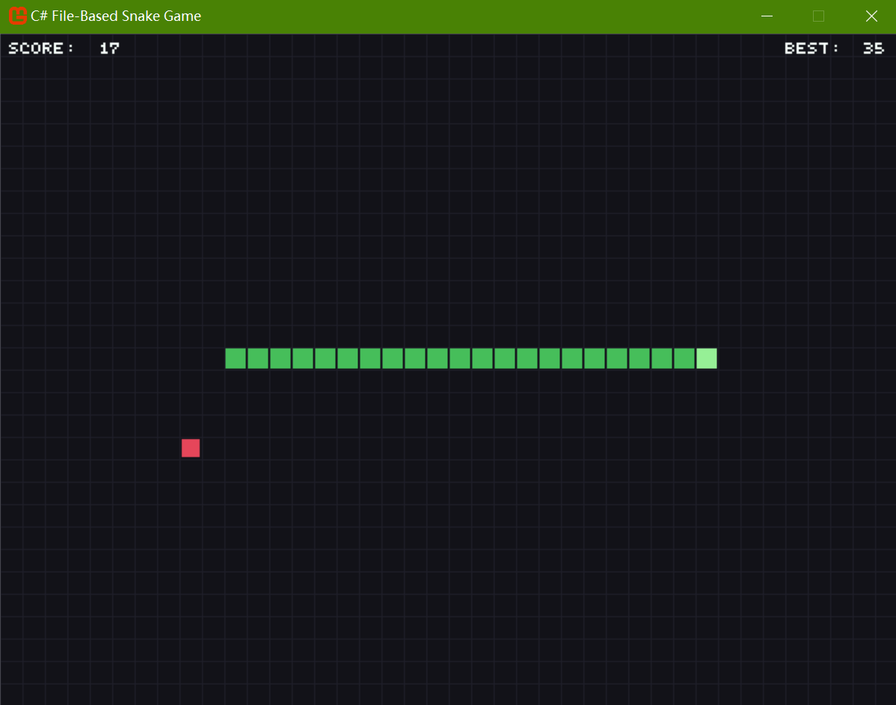
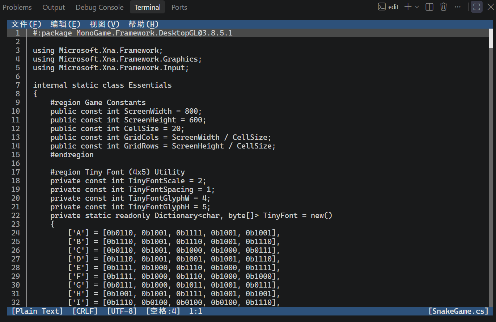

# C# File-Based Snake Game (.NET 10 or Later)




A minimal, self-contained snake game written as a single C# file, using the MonoGame framework and .NET 10, to relieve myself from mental strain during the exam prep. (See [A Note From the Author](#a-note-from-the-author) for a full story.)

## Description

This project demonstrates that a complete, playable game can fit in one file. It uses C# 14's file-based app syntax (`#:package`) to declare its MonoGame dependency inline, and it renders every character — the title, the score, the pause overlay, the game over screen — using a bitmap font defined directly in the source.

No external XNB assets, no content pipeline. Just code, a hand-designed 4×5 pixel font, and a grid. Besides, the snake itself is a `LinkedList<Point>`: O(1) insertion at the head, O(1) removal at the tail. No arrays, no resizing, no shifting.

## Prerequisites

- [.NET SDK 10](https://dotnet.microsoft.com/download) or later
- [Visual Studio Code](https://code.visualstudio.com/), [Microsoft Edit](https://github.com/microsoft/edit), or your preferred editor

MonoGame is declared via the `#:package` directive at the top of `SnakeGame.cs` and is restored automatically on first run.

## How to Play

### Installation

```bash
git clone https://github.com/Pac-Dessert1436/FileBasedSnakeGame.CSharp.git
cd FileBasedSnakeGame.CSharp
```

### Running

```bash
dotnet run SnakeGame.cs
```

Or open `SnakeGame.cs` in your preferred editor:

```bash
code .            # Visual Studio Code
edit SnakeGame.cs # Microsoft Edit
```

### Controls

| Key | Action |
|-----|--------|
| Arrows / W A S D | Move the snake |
| P | Pause or resume |
| R | Restart after game over |
| Space | Pause/resume during play; restart after game over |
| Escape | Quit |

## Technical Highlights

- **Single-file architecture.** Everything — constants, font, extensions, game loop — lives in `SnakeGame.cs`.
- **Hand-designed 4×5 bitmap font.** Capital letters, numbers and symbols. Each defined as five bytes of binary pixel data. No font files, no texture atlases.
- **`LinkedList<Point>` for the snake body.** The right data structure for a queue that grows at one end and shrinks at the other.
- **Edge-detected input.** A `_prevKeyboard` state prevents held keys from firing repeatedly.
- **Buffered direction changes.** `_pendingDirection` prevents 180° reversals and smooths rapid input.
- **Contextual pause overlay.** The overlay is drawn last, so it dims everything beneath it without needing a separate render pass.

## A Note From the Author

*September 28, 2026 — 81 days before the postgraduate entrance exam*

I didn't come back to GitHub to "avoid the exam unthinkingly." I came back only for the moment, because I needed to prove something to myself that **I can still finish something**.

When you spend three years preparing for a single exam, every unfinished thing accumulates. The half-read chapter. The unanswered question. The morning you woke up intending to study and instead stared at the desk for several hours. These are not failures of discipline, but the sediment of a long, slow climb. **But sediment builds, and eventually it buries the person underneath it.**

This snake game is not a distraction from that sediment. It is a firm decision of mine.

I designed the 4×5 font glyph by glyph — capital letters, numbers and symbols, each one five bytes of binary. I wrote the collision logic so the tail is handled correctly. I right-aligned the score so it doesn't jitter. None of these things were necessary. That is the point. **Necessity is what the exam demands. Necessity is not what keeps me alive.**

There is a difference between resting and quitting. It is between pausing and dying. There is a myth that says the only way to prepare for something important is to give it everything — the myth is wrong, because a system running at 100% load indefinitely will eventually throttle, hang and die. I have spent enough time in the fog to know that the fog is not laziness, but the sound of a system that has been running at full load for too long, waiting for permission to cool down. 

To anyone else standing at the edge of a long exam: **you are allowed to build something small for yourself** — not because it helps you pass, but because it reminds you that you are more than "the thing you are preparing for." The exam measures one configuration; you are running a whole system throughout your lifetime.

**We all bite the bullet eventually, and I get to choose what I bite it for.**



## License

This project is licensed under the MIT License. See [LICENSE](LICENSE) for details.